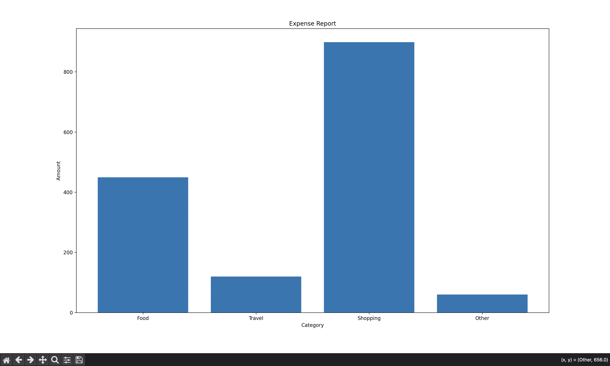

# AI Expense Tracker

A Python project that analyzes SMS-style transaction messages and generates an expense report with graphs.

## Features
- Detect expenses from transaction text
- Categorize spending (Food, Travel, Shopping)
- Generate a monthly expense report
- Visualize spending with graphs

## Technologies Used
- Python
- Matplotlib

## Project Structure
ai-expense-tracker
│
├── main.py
├── sms_reader.py
├── expense_classifier.py
└── report.py

## How to Run

python3 main.py

## Output

